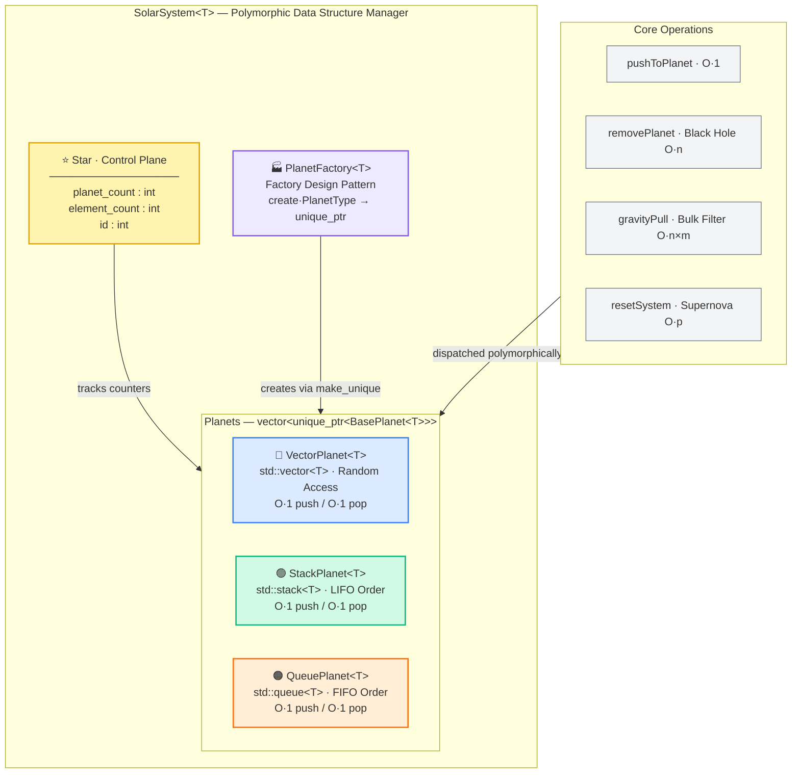

# SolarSystem — Polymorphic Data Structure Manager


## Overview

**SolarSystem** is a professional C++ data structure library that manages heterogeneous collections through a unified polymorphic interface. Using a Solar System metaphor, each "planet" represents a distinct data structure (Vector, Stack, or Queue), all governed by a central `SolarSystem<T>` controller.

<p align="center">
  
  <br />
  <em>High-level architecture of the SolarSystem library.</em>
</p>

<details>
<summary><strong>Interactive Architecture Diagram (Mermaid)</strong></summary>



</details>

The library demonstrates modern C++ best practices including RAII ownership, polymorphic dispatch, factory-based creation, template generics, const-correctness, move semantics, and structured exception handling.

---

## System Components

The solar system is composed of a central **Star** controller and three polymorphic **Planet** types, each backed by a different STL container.

<p align="center">
  
  <br />
  <em>Star — The central controller that tracks all system-wide metrics.</em>
</p>

| Component | Image | Data Structure | Access Pattern | Push | Pop |
|---|:-:|---|---|:-:|:-:|
| **VectorPlanet** |  | `std::vector<T>` | Random access, dynamic array | $O(1)$ amortized | $O(1)$ |
| **StackPlanet** |  | `std::stack<T>` | LIFO — last in, first out | $O(1)$ | $O(1)$ |
| **QueuePlanet** |  | `std::queue<T>` | FIFO — first in, first out | $O(1)$ | $O(1)$ |

### Component Responsibilities

| Class | Role | Key Feature |
|---|---|---|
| `SolarSystem<T>` | Top-level orchestrator | Owns all planets via `vector<unique_ptr<BasePlanet<T>>>`. |
| `Star` (internal struct) | Metadata controller | Stores `planet_count` and `element_count` for $O(1)$ queries. |
| `BasePlanet<T>` | Abstract interface | Pure virtual contract: `push`, `pop`, `size`, `display`, `removeBelow`. |
| `PlanetFactory<T>` | Factory creator | Instantiates the correct derived type from a `PlanetType` enum. |

---

## Real-Life Analogy — Data Center Model

The SolarSystem architecture maps directly to a real-world data center. Each abstraction in the codebase has a tangible counterpart:

<p align="center">
  
  <br />
  <em>Mapping SolarSystem components to data center infrastructure.</em>
</p>

| SolarSystem Component | Real-World Counterpart | Role |
|---|---|---|
| `SolarSystem<T>` | **Data Center** | Central orchestrator that owns and manages all resources. |
| `Star` (internal struct) | **Control Plane / Dashboard** | Tracks global metrics ($p$, $n$) in $O(1)$ without polling. |
| `BasePlanet<T>` | **Abstract Storage Interface** | Polymorphic contract that all storage backends must implement. |
| `VectorPlanet<T>` | **Random-Access Array Store** | Indexed storage with $O(1)$ amortized append. |
| `StackPlanet<T>` | **LIFO Message Queue** | Last-in-first-out buffer (e.g., undo history, call stack). |
| `QueuePlanet<T>` | **FIFO Task Queue** | First-in-first-out pipeline (e.g., job scheduler, event bus). |
| `PlanetFactory<T>` | **Provisioning Service** | Factory that spins up new storage instances on demand. |
| `pushToPlanet()` | **Write / Enqueue** | Inserts a record into a specific storage backend. |
| `deleteElement()` | **Dequeue / Pop** | Removes a single record following the backend's ordering. |
| `removePlanet()` (Black Hole) | **Decommission Server** | Destroys a storage node and reclaims all its memory. |
| `gravityPull()` | **Garbage Collection / TTL Sweep** | Bulk-removes stale records below a threshold across all nodes. |
| `resetSystem()` (Supernova) | **Full Cluster Teardown** | Destroys every node and resets all counters to zero. |
| `std::unique_ptr` | **Exclusive Resource Lock** | Guarantees single-owner semantics — automatic deallocation on scope exit. |

---

## Project Structure

```
SolarSystem/
├── assets/
│   ├── architecture_diagram.png   # High-level system architecture
│   ├── star_core.png              # Star controller visualization
│   ├── vector_ring.png            # VectorPlanet visualization
│   ├── stack_silo.png             # StackPlanet visualization
│   ├── queue_belt.png             # QueuePlanet visualization
│   └── analogy_visualization.png  # Data center analogy diagram
├── include/
│   ├── Planet.hpp                 # BasePlanet<T>, derived classes, PlanetFactory<T>
│   └── SolarSystem.hpp            # SolarSystem<T> class (encapsulated controller)
├── src/
│   ├── main.cpp                   # Application entry point
│   └── SolarSystem.cpp            # Explicit template instantiation
├── tests/
│   └── unit_tests.cpp             # Google Test unit tests
├── .github/
│   └── workflows/
│       └── cpp-ci.yml             # CI pipeline (build + test on push)
├── CMakeLists.txt                 # CMake build configuration
└── README.md
```

---

## Complexity Analysis

| Operation | Method | Time Complexity | Space Complexity |
|-----------|--------|:-:|:-:|
| Add planet | `addPlanet()` | $O(1)$ amortized | $O(1)$ |
| Push element | `pushToPlanet()` | $O(1)$ amortized | $O(1)$ |
| Pop element | `deleteElement()` | $O(1)$ | $O(1)$ |
| Remove planet (Black Hole) | `removePlanet()` | $O(n)$ | $O(1)$ |
| Reset system (Supernova) | `resetSystem()` | $O(p)$ | $O(1)$ |
| Gravity pull | `gravityPull()` | $O(n \times m)$ | $O(m)$ |
| Display all | `travelPlanet()` | $O(p \times m)$ | $O(m)$ |
| Element count | `getElementCount()` | $O(1)$ | $O(1)$ |
| Planet count | `getPlanetCount()` | $O(1)$ | $O(1)$ |
| Validate count | `getActualElementCount()` | $O(p)$ | $O(1)$ |

> Where $p$ = number of planets, $n$ = total elements across the system, and $m$ = maximum elements in a single planet.

### Gravity Pull — Detailed Analysis

The `gravityPull(threshold)` operation performs a bulk filter across every planet, removing all elements whose value falls below the threshold. Its cost is $O(n \times m)$ because it must iterate through all $p$ planets and scan up to $m$ elements within each:

```
for each planet p_i in planets:          // p iterations
    for each element e_j in p_i:         // m iterations (per planet)
        if e_j < threshold:
            remove e_j
star.element_count -= total_removed       // O(1) counter update
```

| Metric | Value | Explanation |
|--------|:-----:|-------------|
| **Time** | $O(p \times m)$ | Outer loop visits $p$ planets; inner loop scans up to $m$ elements per planet. |
| **Space** | $O(m)$ | Stack/Queue planets require a temporary container to rebuild; VectorPlanet uses in-place erase-remove with $O(1)$ auxiliary space. |

**Implementation details:**

- **VectorPlanet** uses the erase-remove idiom (`std::remove_if` + `erase`) for in-place filtering — zero temporary allocations.
- **StackPlanet / QueuePlanet** lack iterator access (container adaptors), so elements are drained into a temporary, filtered, and moved back.
- The `star.element_count` counter is decremented by the total removed count in $O(1)$ after the sweep.

---

## Usage Guide

```cpp
#include "SolarSystem.hpp"

int main() {
    // Initialize a SolarSystem storing integers
    SolarSystem<int> system;

    // Add planets via Factory Pattern (no manual new/delete)
    system.addPlanet(PlanetType::Stack);    // Planet 0: LIFO
    system.addPlanet(PlanetType::Vector);   // Planet 1: Random-access
    system.addPlanet(PlanetType::Queue);    // Planet 2: FIFO

    // Push elements into the Stack planet
    system.pushToPlanet(0, 42);
    system.pushToPlanet(0, 17);
    system.pushToPlanet(0, 99);

    // Display all planets and their contents
    system.travelPlanet();

    // Gravity Pull: remove all elements < 20
    system.gravityPull(20);   // 17 is absorbed; 42 and 99 survive

    // Supernova: destroy the entire system (RAII — all memory freed)
    system.supernova();
    // system.getPlanetCount() == 0
    // system.getElementCount() == 0

    return 0;
}
```

> **Key point:** No `new`, `delete`, or manual memory management appears anywhere. `std::unique_ptr` destructors handle deallocation automatically when planets are removed or the system is reset.

---

## Technical Decisions — Why Modern C++?

This project deliberately avoids legacy C++ memory patterns in favor of modern idioms introduced in C++11/14/17.

### Migration from `new`/`delete` to `std::unique_ptr`

The most impactful architectural decision was replacing all manual heap management with RAII smart pointers:

| Legacy Pattern | Modern Replacement | Benefit |
|---|---|---|
| `new BasePlanet<T>(...)` | `std::make_unique<VectorPlanet<T>>()` | Eliminates raw pointer ownership ambiguity. |
| Manual `delete` | Automatic `unique_ptr` destructor | Guarantees deallocation — even when exceptions are thrown. |
| Raw pointer arrays | `std::vector<std::unique_ptr<...>>` | Resizable, bounds-aware, RAII-managed container of owners. |
| Copy-heavy transfers | `std::move()` semantics | Transfers ownership in $O(1)$ without deep-copying data. |
| `char` type flags | `enum class PlanetType` | Compile-time type safety with scoped enumerators. |
| C-style casts `(int)x` | `static_cast<int>(x)` | Explicit, searchable, and prevents unsafe conversions. |

### Memory Safety Guarantee

Every allocation path in SolarSystem follows RAII:

1. **Planet creation** — `PlanetFactory<T>::create()` returns a `unique_ptr`. Ownership transfers to the `planets` vector via `std::move`.
2. **Planet destruction** (`removePlanet`) — Erasing the `unique_ptr` from the vector triggers the destructor chain: `unique_ptr` → `BasePlanet<T>` virtual destructor → derived class destructor → internal `vector<T>` / `stack<T>` / `queue<T>` destructor. Zero manual cleanup.
3. **Full reset** (`resetSystem`) — `planets.clear()` destroys every `unique_ptr` in sequence. After the call, zero heap memory remains allocated for any planet or element.

This design makes memory leaks, double-frees, and dangling pointers **structurally impossible** under normal execution flow.

### Why `std::string` over `char*`?

Planet names are stored as `std::string` instead of raw `char*` arrays. This eliminates buffer overflows, manual `strlen`/`strcpy` calls, and provides automatic deallocation when the owning object is destroyed — another RAII guarantee at zero additional cost.

---

## Build Instructions

### Prerequisites

- C++17 compatible compiler (GCC 7+, Clang 5+, MSVC 2017+)
- CMake 3.14+ (GTest is fetched automatically via FetchContent)

### Build & Run

```bash
# Configure
cmake -S . -B build -DCMAKE_BUILD_TYPE=Release

# Build
cmake --build build --config Release

# Run application
./build/SolarSystem

# Run unit tests
cd build && ctest --output-on-failure --verbose
```

### Alternative (without CMake)

```bash
# Build application
g++ -std=c++17 -Wall -Wextra -I include -o SolarSystem src/main.cpp src/SolarSystem.cpp

# Run
./SolarSystem
```

---

## Testing

The project includes 22 unit tests covering:

- **pushToPlanet** — Push to all planet types, boundary conditions, invalid indices.
- **removePlanet (Black Hole)** — Planet destruction, element count decrements, edge cases.
- **gravityPull** — Threshold filtering across all planet types, boundary values.
- **resetSystem (Supernova)** — Full system destruction and RAII verification.
- **Element Count Validation** — After every operation, `star.element_count` is verified against the actual sum of all planet elements.

---

## License

This project is licensed under the MIT License.
